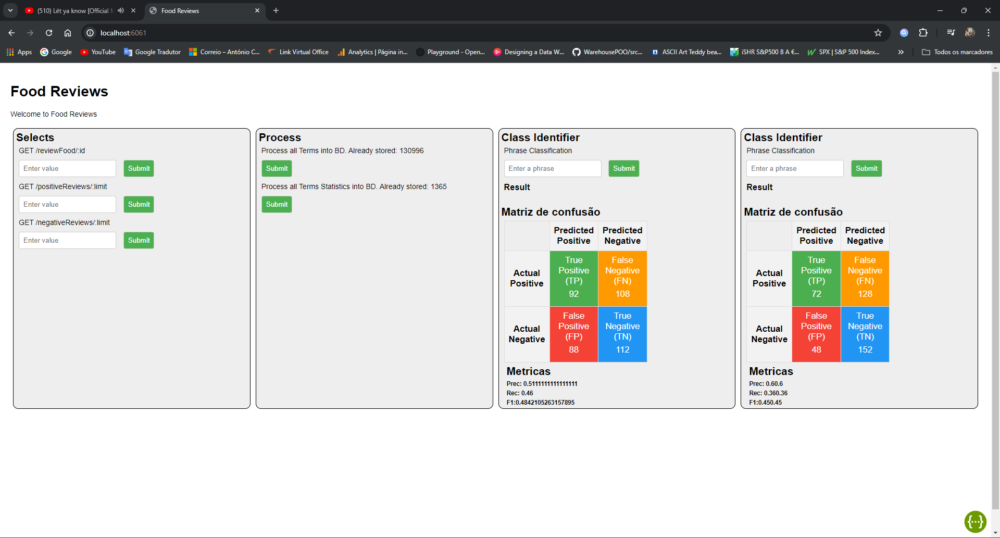
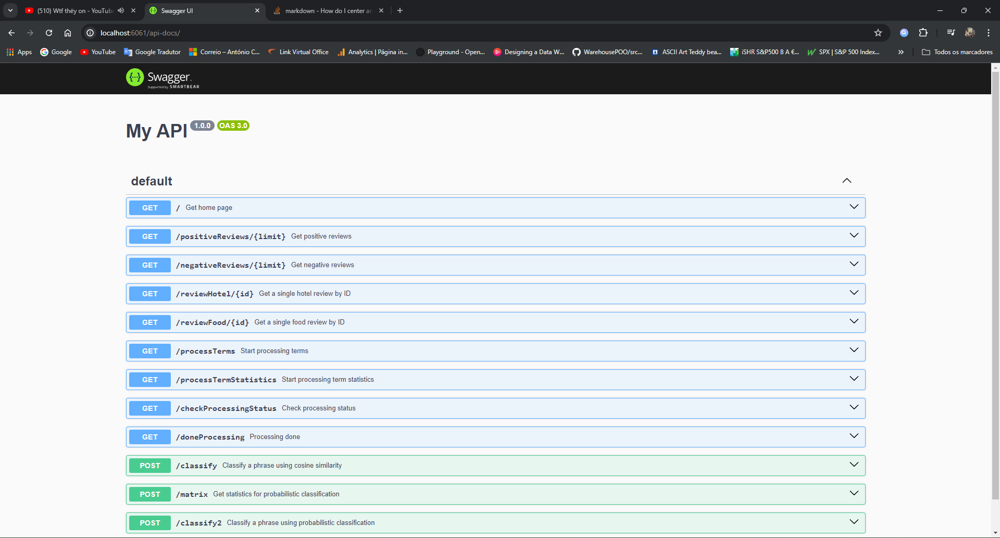

# Manual Técnico - Classificador de Texto

Instituto Politécnico de Setúbal - ESTS

Metrado Engenharia Informática - Extração Automática de Informação

António Carlos Ferreira Pinto<br>
Diogo Costa<br>
Guilherme Malhado<br>


<div style="page-break-after: always;"></div>

# Indice
1. [Motivo](#1)<br>
   1. [Ferramentas de programação](#1.1)
2. [Dataset](#2)
   1. [Filtragem do dataset](#2.1)
3. [Pré-processamento](#3)
   1. [Modelo de dados](#3.1)
   2. [Tratamento de texto](#3.2)
   3. [Cálculo de tf , idf e tfidf](#3.3)
   4. [Cálculo de estatisticas para cada termo](#3.4)
   5. [Classificadores](#3.5)
4. [Front-End](#4)
5. [Back-End](#5)
5. [Base de Dados](#6)
5. [Execução do código](#7)

<div style="page-break-after: always;"></div>

# Motivo <a name="1"></a>

O desenvolvimento deste projeto visa criação de um modelo de previsão através de machine learning de modo a classificar textos com recurso a texto já classificados (Aprendimento supervisionado). Pretende-se classificar textos entre duas classes, classe positiva e classe negativa.

## Ferramentas de programação <a name="1.1"></a>

Para efetuar este trabalho foram utilizadas as linguagens Javascript para efetuar a criação tanto da parte do servidor que processa os dados como a parte que disponibiliza o front-en para retirar informações

# Dataset <a name="2"></a>

O dataset é uma parte crucial no treino de dados para a construção de classificadores de Machine Learning. O dataset escolhido para o efeito de treino foi o foodReviews.csv. Este dataset consiste em 568 454 reviews de utilizadores. A distribuição das classificações não apresenta uniformidade entre as diferentes classificações como mostra a tabela a seguir.

| Classificação | Número de casos | Percentagem do Dataset |
| :------------ | :-------------: | ---------------------: |
| 1             |     52 268      |                  9,3 % |
| 2             |     29 769      |                  5,3 % |
| 3             |     42 640      |                  7,5 % |
| 4             |     80 655      |                 14,1 % |
| 5             |     363 122     |                 63,8 % |

## Filtragem do dataset <a name="2.1"></a>

É essencial reduzir a quantidade de casos e utilizar o mesmo número de casos da mesma classe para o treino do modelo preditivo. O dataset foi filtrado para a remoção de casos sem valor ou "null", no entanto nenhum dado foi removido dado que o dataset não continha valores null.

No entanto o dataset continha no total 174 886 casos de textos duplicados, que foram removidos para melhorar a qualidade do dataset.

| Id | ProductId | UserId | ProfileName | Helpfulness Numerator | Helpfulness Denominator | Score | Time | Summary | Text |
|-----|-------------|-----------------|---------------|----------------------|------------------------|-------|------------|-------------------------|--------------------------------------------------------------------------------------------------------------------------------------------------------------------------------------------------------------------------------------------------------------------------------------------------------------------------------------------------------|
|1 | B001E4KFG0 |A3SGXH7AUHU8GW |delmartian |1 |1 |5 |1303862400 |Good Quality Dog Food |I have bought several of the Vitality canned dog food products ...|
|2 |B00813GRG4 |A1D87F6ZCVE5NK |dll pa |0 |0 |1 |1346976000 |Not as Advertised| Product arrived labeled as Jumbo Salted Peanuts...
|3 |B000LQOCH0 |ABXLMWJIXXAIN |Natalia Corres "Natalia Corres" |1 |1 |4 |1219017600 |"Delight" says it all |This is a confection that has been around a few centuries. It is a light, ...|

# Pré-processamento <a name="3"></a>

## Modelo de dados <a name="3.1"></a>

Para o pré-processamento foi feito o agrupamento das classes 4 e 5, que criaram uma nova classe "Positiva", e agrupados as classes 1 e 2, que criaram a classe "Negative". Estas serão as classes propostas para previsão através de um texto posteriormente. Os textos com classificação "3" foram ignorados devido á natureza muito próxima das duas classificações apresentando um meio termo.

Adicionalmente, o dataset continha dois campos, nomeadamente "Summary" e "Text", que continham informação relevante á review do consumidor. Por isso, considerando que os dois campos são importantes para a percepção da classificação da review, os dois textos foram combinados de modo a gerar um campo "Full Review" que é a concatenação dos campos "Summary" e "Text" seguidos.

Com as classes finais já definidas é feito um filtro de modo a ficar com dois datasets, um para treino e um para teste. Deste modo foram considerados aleatóriamente 800 exemplos de classificação "Positiva" e 800 exemplos de classificação "Negativa" para treino. Já no dataset de teste foram considerados aleatóriamente 200 exemplos de classificação "Positiva" e 200 exemplos de classificação "Negativa". É de ressaltar que não existe a mesma ocorrencia de um caso em ambos os datasets.

## Tratamento de texto <a name="3.2"></a>

O processamento do texto visa normalizar as palavras de modo a ter um ponto de partida para o treino do modelo com dados. As alterações ao texto original consistem nalguns passos subquentes como a remoção de letras capitalizadas, de modo a conter apenas letras descapitalizadas, remoção de simbolos para apenas conter letras de [a-z] e limpeza de espaços que não estejam entre palavras e repetição de espaços.

Os textos são processados de modo a manter palavras com o mesmo significado com um formato idêntico, exemplo: As palavras "working" e "work" são convertidas para a mesma palavra "work".

```javascript
function toLowerCase(inputText) {
  return inputText.toLowerCase();
}

function trimSpaces(inputText) {
  let trimmedText = inputText.trim();
  return trimmedText.replace(/\s+/g, " ");
}

function removeSpecialCharacters(inputText) {
  return inputText.replace(/[^a-z ]/gi, "");
}
```

Cada texto é então processado de modo a remover algumas palavras específicas como "o" e "d" que não dão impacto e ocorrem poucas vezes, normalmente devido a erros de escrita.

De seguida as palavras são agrupadas em bigramas e unigramas de modo a fornecer contexto em como ocorrem naturalmente nos textos como "not organic" e "great sauce".

```javascript
var stpw = require("./stopwords.js");
var stemmr = require("./stemming.js");
var ngram = require("./tokenization.js");
var clean = require("./clean.js");

module.exports = (inputText, numbers, stopWords = []) => {
  // Limpeza de dados
  let cleanText = clean(inputText);

  // Filtro de dados e ngram
  let removedStoppedWordsText = stpw.removeCustomStopwords(
    cleanText,
    stopWords
  );
  let stemmedText = stemmr(removedStoppedWordsText);
  let ngrams = numbers.map((number) => ngram(stemmedText, number));

  return {
    originalText: inputText,
    cleanedText: cleanText,
    preprocessedText: stemmedText,
    tokens: ngrams,
  };
};
```

## Cálculo de tf , idf e tfidf <a name="3.3"></a>

Com os textos processados é feito o processamento dos valores de cada termo presente no conjunto de treino. Cada texto é processado, dividido em bigrama e unigrama, e calculado o valor de tf para o termo no documento.

Os valores são agrupados através da classificação do documento e posteriormente calculada os vetores tf, idf, tfidf, binary e numberOfOccurrences. Cada valor é posteriormente inserido na tabela "term" que contém todas as informações de cada termo encontrado no dataset de treino.

```javascript
const termData = [];

const idfVector = bagOfWrds.idfVector(workerBagOfWords, documents);

for (let i = 0; i < documents.length; i++) {
  const tfVector = bagOfWrds.tfVector(workerBagOfWords, documents[i]);
  const tfidfVector = bagOfWrds.tfidfVector(tfVector, idfVector);
  const binaryVector = bagOfWrds.binaryVector(workerBagOfWords, documents[i]);
  const occurrencesVector = bagOfWrds.numberOfOccurrencesVector(
    workerBagOfWords,
    documents[i]
  );

  for (let j = 0; j < workerBagOfWords.length; j++) {
    const word = workerBagOfWords[j];

    termData.push(
      new Term(
        word,
        binaryVector[j],
        occurrencesVector[j],
        tfVector[j],
        idfVector[j],
        tfidfVector[j],
        docIds[i],
        word.split(" ").length,
        classification
      )
    );
  }
}
```

Após o processamento dos termos, o resultado do processamento dos termos deixa um total de 130 996 ocorrências de termos, sendo 64 872 de classificação positiva e 66 124 de classificação negativa, o que demonstra um equilibrio entre termos positivos e termos negativos ao apresentarem ambas valores semelhantes. 

É possível analizar que as palavras que ocorrem com maior frequência por classe são as palavras "not" para a classe negative, e "good" para a classe positiva.

|classification| name | total_occurrences|
|--------------|------|:-----------------|
| 0            | not  |               880|
| 1            | good |               571|

## Cálculo de estatisticas para cada termo <a name="3.4"></a>

Nesta fase, são recolhidos os termos das classes positivas e negativas, juntamente com unigramas e bigramas. São recolhidos quatro arrays com estas informações com cada combinação possível. Exemplo, positiva-unigrama, positiva-bigrama, negativa-unigrama ...

Estes dados servirão para calcular os melhores K termos, onde K representa 20% dos termos de cada array anteriormente referido. Foi utilizada a métrica tfIdf e a média desses valores para termos iguais.

``` javascript
async function processTermStatistics() {
    let resolvedResults = [
        await termRepository.getAllTermsWithFilters(0, 1), //classificação negativa / 0 e unigrama / 1
        await termRepository.getAllTermsWithFilters(0, 2),
        await termRepository.getAllTermsWithFilters(1, 1),
        await termRepository.getAllTermsWithFilters(1, 2)
    ]

    for (const terms of resolvedResults) {
        let results = featureSelection.selectKBest(terms, "tfIdf", true)
        for(const result of results){
            await termStatisticRepository.insertTermStatistic(result)
        }
    }

}
```

## Classificadores <a name="3.5"></a>

Os classificadores utilizados servem o propósito de classificar novos textos presentes no dataset de teste de modo a prever a classificação destes novos textos e medir a precisão dos modelos

### TF-IDF

O classificador TFIDF utiliza a média desta métrica (tfidf) para criar dois vetores de palavras positivas e dois de palavras negativas que serão combinados por classificação e servirão para calcular o mapa de identificação dos termos e posteriormente calcular a soma de valores. Este processo é efetuado tanto para a lista de classificação positiva como negativa, de modo a calcular a soma com maior valor. Deste modo o resultado da classificação final será a classificação com o máximo dos valores de classificação.

```javascript
let termPositivesList = cache.termsStatistics.find(term => term.label === 1)?.bagOfWords || [];
    let termNegativesList = cache.termsStatistics.find(term => term.label === 0)?.bagOfWords || [];

    const termPositives = new Map(termPositivesList.map(e => [e.name, { tf: e.tf, tfidf: e.tfidf, classification: e.classification }]));
    const termNegatives = new Map(termNegativesList.map(e => [e.name, { tf: e.tf, tfidf: e.tfidf, classification: e.classification }]));

    for (let i = 0; i < preProcessed.tokens.length; i++) {
        let wordIdfPositive = cache.termsOriginalPositive.get(preProcessed.tokens[i])?.idf || 0;
        let wordIdfNegative = cache.termsOriginalNegative.get(preProcessed.tokens[i])?.idf || 0;

        preProcessed.tfidfPositive.push(
            counting.tfidf(
                preProcessed.tf[i] || 0,
                wordIdfPositive
            )
        );
        preProcessed.tfidfNegative.push(
            counting.tfidf(
                preProcessed.tf[i] || 0,
                wordIdfNegative
            )
        );
    }

    let originalTfidfPositive = preProcessed.tokens.map(e => { return termPositives.get(e)?.tfidf || 0 });
    let originalTfidfNegative = preProcessed.tokens.map(e => { return termNegatives.get(e)?.tfidf || 0 });

    let similarityCossenPositive = cosineSimilarity(preProcessed.tfidfPositive, originalTfidfPositive);
    let similarityCossenNegative = cosineSimilarity(preProcessed.tfidfNegative, originalTfidfNegative);

    let decision = +(similarityCossenPositive > similarityCossenNegative);

    return {
        decision: decision,
        similarityCossenPositiveNegative: [similarityCossenPositive, similarityCossenNegative]
    };
```

Resultados para o tfidf:

| |Predicted Positive|Predicted Negative|
|-|-|-|
|Actual Positive|True Positive (TP) 102 |False Negative (FN) 98|
|Actual Negative|False Positive (FP) 94 | True Negative (TN) 106 |

Metricas
Prec: 0.5204081632653061<br>
Rec: 0.51<br>
F1: 0.5151515151515151<br>

### Naive-Bayes  

O classificador Naive Bayes com TF-IDF utiliza a frequência dos termos e a métrica TF-IDF para calcular probabilidades de classificação para termos positivos e negativos. Primeiro, os tokens são extraídos e suas frequências calculadas. Depois, somas de TF-IDF são obtidas para cada classe. As probabilidades para cada termo são normalizadas e multiplicadas pelas somas de classe, ajustadas pelas probabilidades a priori. A decisão final é baseada na comparação das probabilidades acumuladas para as classes positiva e negativa, retornando a classificação com o maior valor.

```javascript
// obter soma das classes 
    const tfIdfClassSums = await termStatisticRepository.getTermStatisticTfidfSum()
    const termsTfIdf = await termStatisticRepository.getTermStatisticTfidf(preProcessed.tokens)


    let finalValuePositive = 1;
    let finalValueNegative = 1;

    termsTfIdf.forEach(term => {
        if (term.positiveTfIdf != 0) {
            finalValuePositive *= ((term.positiveTfIdf) * tfIdfClassSums.get(1))
        }
        if (term.negativeTfIdf != 0) {
            finalValueNegative *= ((term.negativeTfIdf) * tfIdfClassSums.get(0))
        }
    });

    finalValuePositive *= PositiveApriori
    finalValueNegative *= NegativeApriori

    let decision = +(finalValuePositive > finalValueNegative);
    return {
        decision: decision,
        naiveBayes: [finalValuePositive, finalValueNegative]
    };
```

Resultados para o tfidf:

| |Predicted Positive|Predicted Negative|
|-|-|-|
|Actual Positive|True Positive (TP) 153 |False Negative (FN) 47|
|Actual Negative|False Positive (FP) 38 | True Negative (TN) 162 |

Metricas
Prec: 0.8010471204188482<br>
Rec: 0.765<br>
F1: 0.7826086956521738<br>

# Front-End <a name="4"></a>

Através do front end é possível comunicar com o back-end e fazer operações essenciais para o desenvolvimento do projeto. O front end foi feito utilizando a biblioteca ejs que facilita o processo de desenvolvimento.

<div style="text-align:center"></div>


# Back-End <a name="5"></a>

O back-end fornece rotas para pedidos de processamento como "process terms" e "process term statistics" de modo a popular as tabelas na base de dados. Este foi construido utilizando express e node usando a linguagem de programação javascript.

As rotas disponibilizadas pelo back-end estão demonstradas no link de swagger /api-docs/



# Base de dados <a name="6"></a>

A base de dados escolhida para o projeto foi uma instância em MySql. Esta base de dados hospedada proporcionou uma pesistência nos dados para todos os desenvolvedores.
De seguida mostra-se a constituição das tabelas utilizadas para o projeto.
A primeira "food_review" é constituida pelos dados originais e a adição de um campo "FullReview" que combina o campo "Summary" com o campo "Text", a ser considerado no treino e teste do modelo de classificação.

```mysql
CREATE TABLE `food_review` (
   `Id` int(11) NOT NULL,
   `ProductId` varchar(255) DEFAULT NULL,
   `UserId` varchar(255) DEFAULT NULL,
   `ProfileName` varchar(255) DEFAULT NULL,
   `HelpfulnessNumerator` int(11) DEFAULT NULL,
   `HelpfulnessDenominator` int(11) DEFAULT NULL,
   `Score` int(11) DEFAULT NULL,
   `Time` bigint(20) DEFAULT NULL,
   `Summary` text,
   `Text` text,
   `FullReview` text,
   PRIMARY KEY (`Id`)
 ) ENGINE=InnoDB DEFAULT CHARSET=latin1
```

A tabela "Term" é constituida pelos termos encontrados ao longo dos documentos considerados de treino de modo a fazer algumas análises estatísticas como o número de ocorrencias, valores tf, idf e tfidf.

```mysql
CREATE TABLE `term` (
   `id` int(11) NOT NULL AUTO_INCREMENT,
   `name` varchar(50) NOT NULL,
   `binary` tinyint(4) NOT NULL,
   `occurrences` int(11) NOT NULL,
   `tf` float NOT NULL,
   `idf` double NOT NULL,
   `tfidf` float NOT NULL,
   `docId` int(11) NOT NULL,
   `wordCount` int(11) NOT NULL,
   `classification` int(11) NOT NULL,
   PRIMARY KEY (`id`)
 ) ENGINE=InnoDB AUTO_INCREMENT=130997 DEFAULT CHARSET=latin1
```

A tabela "term_statistic" fornece as informações dos termos agrupadas e já tratadas seguindo as funções Kbest, minOccurences ... para o efeito de classificação dos termos encontrados em fase de teste.

```mysql
CREATE TABLE `term_statistic` (
   `id` int(11) NOT NULL AUTO_INCREMENT,
   `name` varchar(255) NOT NULL,
   `binary` float NOT NULL,
   `occurrences` float NOT NULL,
   `tf` float NOT NULL,
   `tfidf` float NOT NULL,
   `docIds` text NOT NULL,
   `classification` int(11) NOT NULL,
   PRIMARY KEY (`id`)
 ) ENGINE=InnoDB AUTO_INCREMENT=1366 DEFAULT CHARSET=latin1
```

A classe "termClass" fornece o contexto da classificação. Classes com o atributo "class" com valor 1 pertencem á classe Positiva e com valores a 0 pertencem á classe Negativa.

```mysql
CREATE TABLE `termClass` (
   `id` int(11) NOT NULL AUTO_INCREMENT,
   `class` int(11) NOT NULL,
   `description` varchar(255) NOT NULL,
   PRIMARY KEY (`id`)
 ) ENGINE=InnoDB AUTO_INCREMENT=3 DEFAULT CHARSET=latin1
```

Tabela "training_set" permite fazer a seleção de textos de modo a que com um simples join à tabela food_review permita obter todos os documentos de treino

```mysql
CREATE TABLE `training_set` (
   `id` int(11) NOT NULL AUTO_INCREMENT,
   `review_id` int(11) DEFAULT NULL,
   `class` int(11) NOT NULL,
   PRIMARY KEY (`id`),
   KEY `review_id` (`review_id`),
   CONSTRAINT `training_set_ibfk_1` FOREIGN KEY (`review_id`) REFERENCES `food_review` (`Id`)
 ) ENGINE=InnoDB AUTO_INCREMENT=1824 DEFAULT CHARSET=latin1
```

Tabela "testing_set" permite fazer a seleção de textos de modo a que com um simples join à tabela food_review permita obter todos os documentos de teste


```mysql
CREATE TABLE `testing_set` (
   `id` int(11) NOT NULL AUTO_INCREMENT,
   `review_id` int(11) DEFAULT NULL,
   `class` int(11) NOT NULL,
   PRIMARY KEY (`id`),
   KEY `review_id` (`review_id`),
   CONSTRAINT `testing_set_ibfk_1` FOREIGN KEY (`review_id`) REFERENCES `food_review` (`Id`)
 ) ENGINE=InnoDB AUTO_INCREMENT=456 DEFAULT CHARSET=latin1
```

# Execução do código <a name="7"></a>

Para se executar o código é necessário algumas ferramentas, tais como editor de texto (VSCode), Node instalado (recomendado v18.14.2 ou superior).

O primeiro passo é certificar-se que está na diretoria que contenha os ficheiros app.js e package.json
Com os passos anteriores efetuados terá de correr o seguinte comando para instalar as dependências do projeto:

```cmd
> npm i
```

De seguida copiar o conteúdo do ficheiro sample.env para um novo ficheiro .env que irá conter as credenciais de base de dados com autorização para efetuar operações "Select". Por isso o processamento de termos não estará disponível.

Agora com os passos concluidos pode ser efetuado o script para iniciar o servidor na porta 6061 acessível através do url: http://localhost:6061

Script para iniciar servidor:
```cmd
> npm run start
```