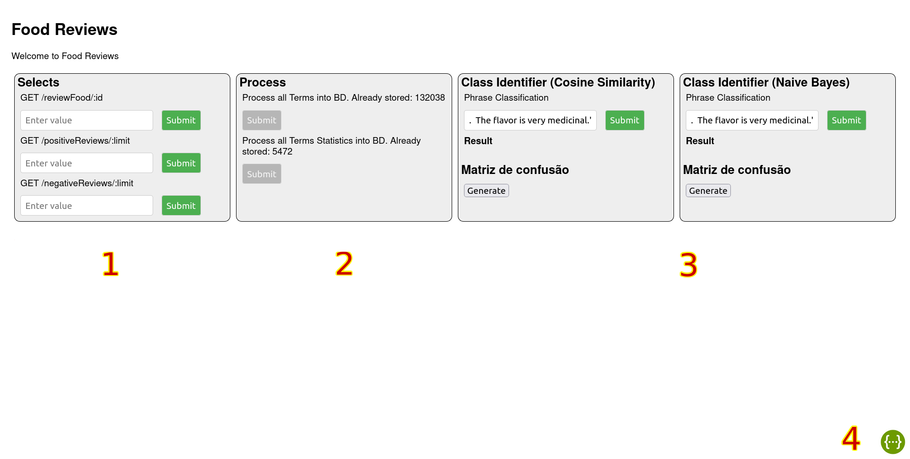
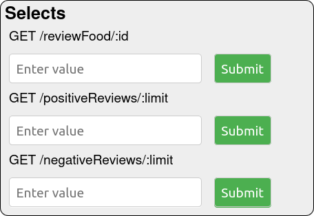
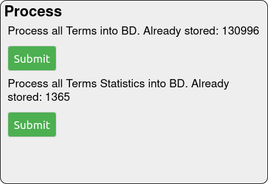
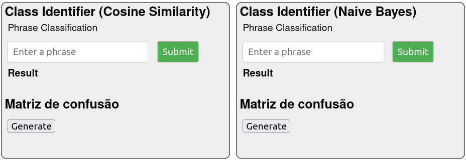
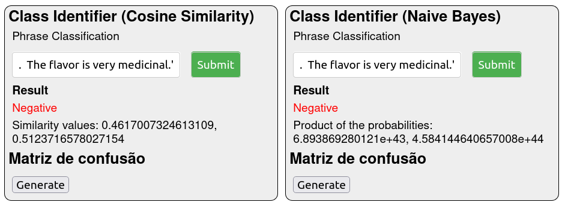
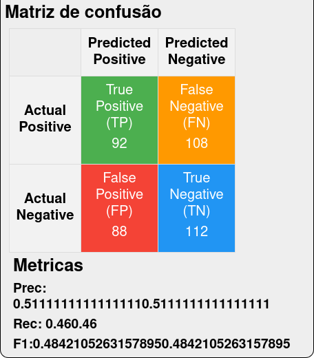

# Manual de Utilizador - Classificador de Texto

Instituto Politécnico de Setúbal - ESTS

Metrado Engenharia Informática - Extração Automática de Informação

António Carlos Ferreira Pinto - 201801432<br>
Diogo Costa<br>
Guilherme Malhado<br>


<div style="page-break-after: always;"></div>

# Indice
1. [Introdução](#1)
2. [Instalação](#2)
3. [Guia de Utilização](#3)
4. [Anexos](#4)

<div style="page-break-after: always;"></div>

# Introdução <a name="1"></a>

Uma aplicação web simples, maioritáriamente de página unica. É um classificador de textos, mais em específico reviews de comida, tendo duas classes para as reviews, reviews Positivas e reviews Negativas.
Feito usando Node.js com Express.js, e uma base de dados em mysql

# Instalação <a name="2"></a>

## Requisitos:
- Nodejs versão 18+

## Correr a aplicação pela primeira vez:
1. Antes de correr o programa localmente criar um ficheiro .env usando o sample.env como base.
2. Num terminal na diretoria da aplicação correr:
```bash
npm i
```
3. No mesmo terminal correr para inicializar a aplicação em localhost, correr:
```bash
npm start
```

# Guia de Utilização <a name="3"></a>

Para inicializar inicializar o a aplicação correr:
```bash
EAI-Labs$ npm start
```
## Estrutura da aplicação web:
A aplicação funciona maioritáriamente numa única página Composta por um titulo e 3 regiões principais distintas (enumeradas na image seguinte)



### 1. Selects - Selecionar dados do nosso dataset



Neste componente o utilizador pode facilmente fazer queries à base de dados para ver diferentes entradas do dataset utilizado para o nosso modelo.

Existem 3 alineas nesta região:
- GET /review/:id -> Endpoint que retorna a review com o id introduzido na textbox;
- GET /positiveReviews/:limit -> Endpoint que retorna X reviews classificadas como positivas (Score de 4 ou 5), X sendo o valor introduzido na textbox;
- GET /negativeReviews/:limit -> Endpoint semelante ao anterior, mas para reviews negativas (Score de 1 ou 2).

### 2. Process
**Esta região da aplicação é desaconcelhável, como tal esta funcionalidade está desativada, uma vez que quando qualquer um destes processos é inicializado íra demorar uma quantidade de tempo considerável. Para alem de que não precisão de ser executados com regularmente.**




Nesta região temos dois botões:
- O primeiro para processar os todos os dados continos no nosso training set, de forma a obter os termos para os nossos classificadores;
- O segundo para depois agregar e processar as componentes desses termos.

Podemos ver nesta região a quantidade de entradas criadas na nossa tabela de termos, sendo cada entrada a presença de um termo num documento; podemos também ver o numero de entradas na nossa table de estatisticas dos termos onde estão os nossos melhores termos agregados.

### 3. Class Identifiers
Temos duas secções semelhantes nesta região, funcionam de forma identica apenas aplicam algoritmos de classificação diferentes. O nome do algoritmo respetivo encontra-se no titulo da região, sendo estes, Similaridade de Cosseno e Naive Bayes.

Na "caixa" de cada secção temos dois elementos o classificador de frases e o gerador da nossa matriz de confusão.



#### Secção 1 - Testar Frases/Reviews originais
Nesta secção o utilizador pode testar uma review de comida original para ver se é identificada com positiva ou negativa.
É só escrever uma frase na textbox e clickar no botão de submit ao lado.
O resultado será a resposta se é classificado como Positivo ou Negativo e os valores ponderados (Similarity values ou Product of Probabilities) respetivos a cada Classe (por ordem Positiva e Negativa).




#### Secção 2 - Matriz de confusão - Testar o classificador
Nesta secção inicialmente temos só um botão para gerar os nossos testes, este quando primido gera a Matriz de confusão e as Métricas Prec, Rec e F1 (Ver anexo I para explicação de o que significa cada um)
**A primeira vez que este processo é efetuado poderá demorar alguns minutos a calcular.**




### 5. Swagger
[Docs](https://swagger.io/docs/)

# Anexos <a name="4"></a>

## Anexo I
### Matriz de confusão

### Metricas
#### Prec - Precision
Precision é uma métrica que indica o quão preciso o modelo está de acordo com os que foram previstos
positivamente, quantos deles é que são de facto positivos. É uma boa medida para determinar quando os
custos de Falso Positivo são altos.
\[
\text{Precision} = \frac{\text{Positivos Verdadeiros}}{\text{Positivos Verdadeiros} + \text{Falsos Positivos}}
\]
#### Rec - Recall
Recall calcula quantos dos Positivos Verdadeiros são capturados quando estimamos como Positivos
Verdadeiros. Neste caso o Recall é uma métrica que terá grande importância quando há um alto custo
associado aos Falsos Negativos.
Recall = Positivos Verdadeiros

\[
\text{Recall} = \frac{\text{Positivos Verdadeiros}}{\text{Positivos Verdadeiros} + \text{Falsos Negativos}}
\]

#### F1 - Score ou F-Measure
É utilizada quando se pretende encontrar um equilíbrio entre o Precision e o Recall. 

\[
\text{F1 Score} = 2 \times \frac{\text{Precision} \times \text{Recall}}{\text{Precision} + \text{Recall}}
\]
