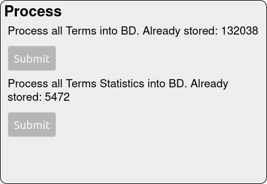

# Manual de Utilizador - Classificador de Texto

Instituto Politécnico de Setúbal - ESTS

Metrado Engenharia Informática - Extração Automática de Informação

António Carlos Ferreira Pinto<br>
Diogo Costa<br>
Guilherme Malhado<br>


<div style="page-break-after: always;"></div>

# Indice
1. [Introdução](#1)
2. [Instalação](#2)
3. [Guia de Utilização](#3)
4. [Anexos](#4)

<div style="page-break-after: always;"></div>

# Introdução <a name="1"></a>

Uma aplicação web simples, maioritáriamente de página unica. É um classificador de textos, mais em específico reviews de comida, tendo duas classes para as reviews, reviews Positivas e reviews Negativas.
Feito usando Node.js com Express.js, e uma base de dados em mysql

# Instalação <a name="2"></a>

## Requesitos:
- Nodejs versão 20.14+
- Mysql client versão 8

## Correr a aplicação pela primeira vez:
1. Antes de correr o programa localmente criar um ficheiro .env usando o sample.env como base.
2. Num terminal na diretoria da aplicação correr:
```bash
EAI-Labs$ npm i
```
3. No mesmo terminal correr para inicializar a aplicação em localhost, correr:
```bash
EAI-Labs$ npm start
```

# Guia de Utilização <a name="3"></a>

Para inicializar inicializar o a aplicação correr:
```bash
EAI-Labs$ npm start
```
## Estrutura da aplicação web:
A aplicação funciona maioritáriamente numa única página


Composta por um titulo e 5 regiões distintas (enumeradas na image)
### 1. Selects - Selecionar dados do nosso dataset


Neste componente o utilizador pode facilmente fazer queries à base de dados para ver diferentes entradas do dataset utilizado para o nosso modelo.

Existem 3 alineas nesta região:
- GET /review/:id -> Endpoint que retorna a review com o id introduzido na textbox;
- GET /positiveReviews/:limit -> Endpoint que retorna X reviews classificadas como positivas (Score de 4 ou 5), X sendo o valor introduzido na textbox;
- GET /negativeReviews/:limit -> Endpoint semelante ao anterior, mas para reviews negativas (Score de 1 ou 2).

### 2. Process
Esta região da aplicação é desaconcelhável mexer, uma vez que qualquer um destes processos é inicializado íra demorar uma quantidade de tempo considerável.




Nesta região temos dois botões:
- O primeiro para processar os todos os dados continos no nosso training set, de forma a obter os termos para os nossos classificadores;
- O segundo para depois agregar e processar as componentes desses termos.

Podemos ver nesta região a quantidade de entradas criadas na nossa tabela de termos, sendo cada entrada a presença de um termo num documento; podemos também ver o numero de entradas na nossa table de estatisticas dos termos onde estão os nossos melhores termos agregados.

### 3. Class Identifier - Similaridade de Cosseno
O primeiro dos nossos dois algoritmos de classificação, podemos testar frases/reviews originais, ou ver os resultados dos testes do nosso classificador.


#### Similaridade de Coseeno
*// todo escrever uma pequena explicação do algoritmo e seu proposito*

#### Secção 1 - Testar Frases/Reviews originais
Nesta secção o utilizador pode testar uma review de comida original para ver se é identificada com positiva ou negativa.
É só escrever uma frase na textbox e clickar no botão de submit ao lado.
O resultado será a resposta se é classificado como Positivo ou Negativo e os valores ponderados (Similarity values) respetivos a cada Classe (por ordem Positiva e Negativa) onde podemos observar que o valor mais elevado é aquele que determina a classe estimada da frase.


#### Secção 2 - Matriz de confusão - Testar o classificador
Nesta secção inicialmente temos só um botão para gerar os nossos testes, este quando primido gera a Matriz de confusão e as Métricas Prec, Rec e F1 (Ver anexo I para explicação de o que significa cada um)
**A primeira vez que este processo é efetuado poderá demorar alguns minutos a calcular.**


### 4. Class Identifier - Naive Bayes
O segundo dos nossos dois algoritmos de classificação, segue o principio de utilização semelhante ao primeiro

#### Naive Bayes
*// todo escrever uma pequena explicação do algoritmo e seu proposito*

#### Before and after


### 5. Swagger

# Anexos <a name="4"></a>

## Anexo I
### Matriz de confusão

### Metricas
#### Prec - 

#### Rec - 

#### F1 - 
